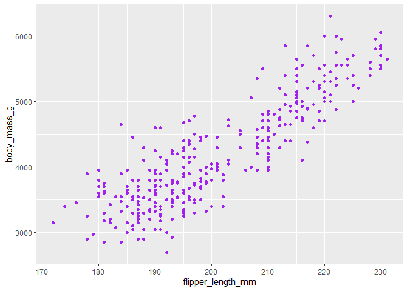
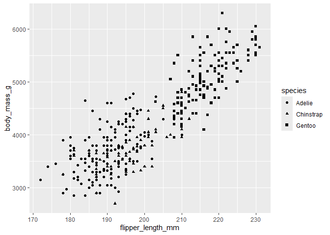
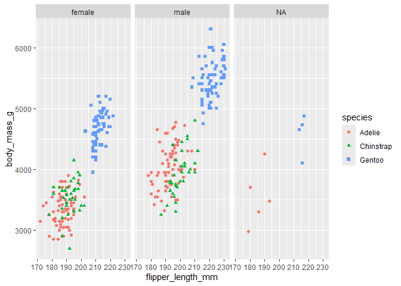

ggplot_hook_codechunk
================
Parth
2024-06-24

## Setting up my environment

Notes : Setting up my environment by loading `tidyverse` and
`palmerpenguins` packages

``` r
library(tidyverse)
```

    ## ── Attaching core tidyverse packages ──────────────────────── tidyverse 2.0.0 ──
    ## ✔ dplyr     1.1.4     ✔ readr     2.1.5
    ## ✔ forcats   1.0.0     ✔ stringr   1.5.1
    ## ✔ ggplot2   3.5.1     ✔ tibble    3.2.1
    ## ✔ lubridate 1.9.3     ✔ tidyr     1.3.1
    ## ✔ purrr     1.0.2     
    ## ── Conflicts ────────────────────────────────────────── tidyverse_conflicts() ──
    ## ✖ dplyr::filter() masks stats::filter()
    ## ✖ dplyr::lag()    masks stats::lag()
    ## ℹ Use the conflicted package (<http://conflicted.r-lib.org/>) to force all conflicts to become errors

``` r
library(palmerpenguins)
```

## Visualizations

Here we will go through a series of visualizations

### Flipper and body mass in purple

Here, we plot flipper length against body mass

``` r
ggplot(data=penguins,aes(x=flipper_length_mm,y=body_mass_g))+
  geom_point(color="purple")
```

    ## Warning: Removed 2 rows containing missing values or values outside the scale range
    ## (`geom_point()`).

<!-- -->

### Flipper and body mass by species

Here, we plot flipper length against body mass and look at the breakdown
by species

``` r
ggplot(data=penguins,aes(x=flipper_length_mm,y=body_mass_g))+
  geom_point(aes(shape=species))
```

    ## Warning: Removed 2 rows containing missing values or values outside the scale range
    ## (`geom_point()`).

<!-- -->

### Flipper and body mass by species and sex

Here, we plot flipper length against body mass and look at the breakdown
by species and sex

``` r
ggplot(data=penguins,aes(x=flipper_length_mm,y=body_mass_g))+
  geom_point(aes(color=species,
                 shape=species)) +
  facet_wrap(~sex)
```

    ## Warning: Removed 2 rows containing missing values or values outside the scale range
    ## (`geom_point()`).

<!-- -->
